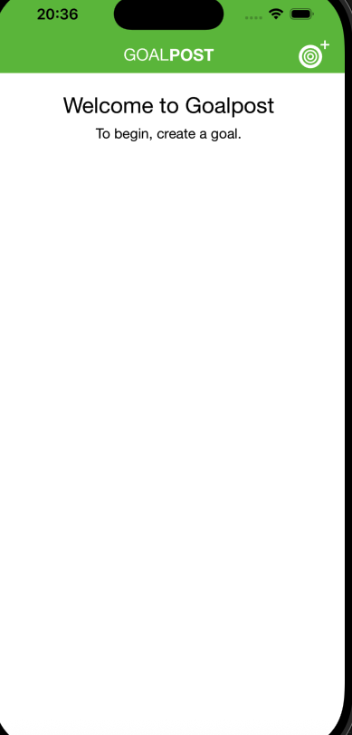
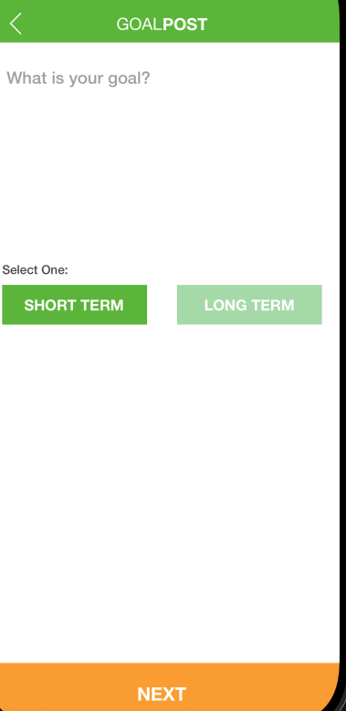
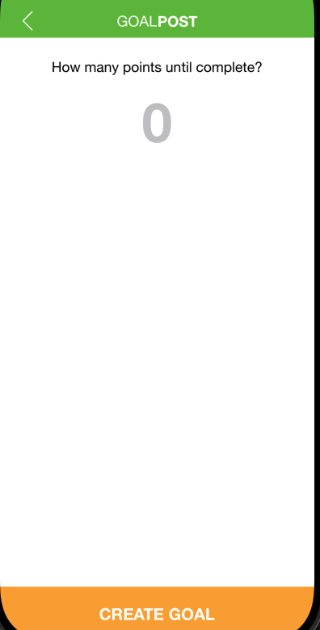
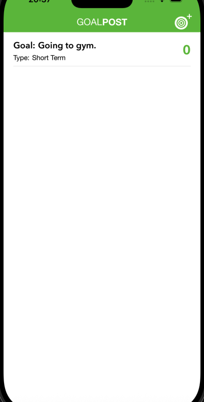
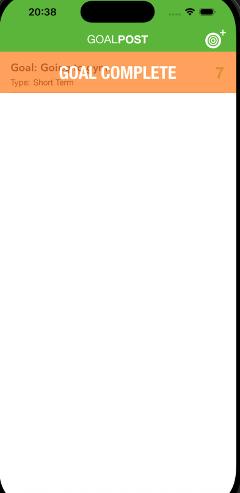
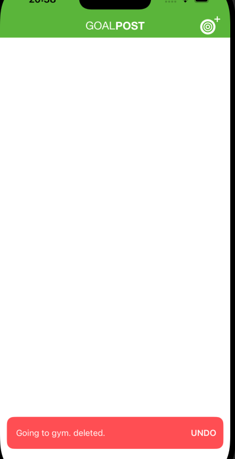

# 🥅 GoalPost

A simple and clean iOS app built to help users create goals, track their
progress, and stay motivated.

GoalPost allows you to: 
- Create short-term or long-term goals
- Set a required completion value
- Increment progress
- Mark goals as complete
- Delete goals with a smooth **UNDO** snackbar
- Store everything persistently using **Core Data**

## 🚀 Features

### ✔ Create & Save Goals

Add a goal, choose its type, and define how many points are required to
complete it.

### ➕ Increase Progress

Swipe left and tap **ADD** to increment progress.
When progress reaches its completion value, the app shows a **Goal
Complete** banner.

### 🗑 Delete With Undo

Swipe left and tap **DELETE**.
A red snackbar appears at the bottom, allowing you to undo for a few
seconds.

### 💾 Persistent Storage

All goals are saved using **Core Data**, ensuring they remain after app
restarts.

## 📸 Screenshots

### Home Screen

### Create Goal – Step 1

### Create Goal – Step 2 (Set Points)

### Goal List After Creating

### Swipe Actions

### Goal Completed Banner

### Undo Delete Snackbar

## 🛠 Tech Stack

-   **Swift**
-   **UIKit**
-   **Core Data**
-   **Auto Layout**
-   **MVC Architecture**

## 📂 Project Structure

    GoalPostApp/
    │
    ├── Controllers/
    │   ├── GoalsVC.swift
    │   ├── CreateGoalVC.swift
    │   └── FinishGoalVC.swift
    │
    ├── Views/
    │   └── GoalCell.swift
    │
    ├── Model/
    │   └── Goal+CoreDataClass.swift
    │
    └── Resources/
        ├── Storyboard
        └── Assets

## 🔧 Installation

1.  Clone this repository:

        git clone https://github.com/your-username/GoalPost.git

2.  Open the project:

        open GoalPost.xcodeproj

3.  Build & run on simulator or device using **Xcode**.

## 📝 License

This app was built for learning purposes.\
Feel free to use it, modify it, and improve it.
